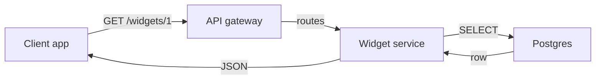

# Widget service — how it fits together

A small walkthrough of the widget service: what it does, how a request flows
through it, and what each piece is responsible for. Written in plain language.

## What it does

The widget service exposes an HTTP API that a client app talks to. It validates
the incoming request, looks the widget up in the database, and returns it as
JSON. There is one public endpoint today: `GET /widgets/{id}`.

## How a request flows

The gateway handles routing and rate limiting, the service holds the logic, and
Postgres stores the data. A request enters at the gateway, gets forwarded to the
service, which reads the row from Postgres and returns it as JSON.

## What each piece does

| Piece | Responsibility |
|---|---|
| API gateway | Routing, rate limiting, request IDs |
| Widget service | Validation and business logic |
| Postgres | Durable storage of widgets |
